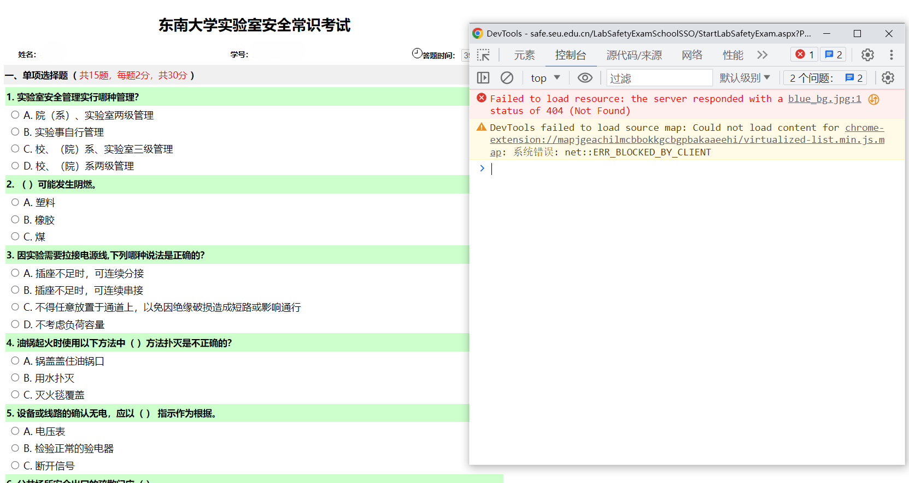
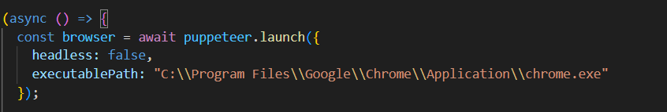
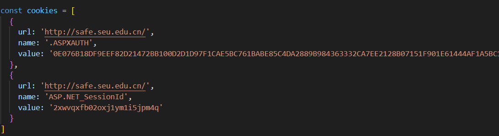

# 东南大学实验室安全考核自动答题脚本

## 介绍

最近要做一个实验室安全考核，网上没有搜到现成的答案，然后题库大概有七百多题，如果自己去一个个查找回答比较麻烦，就做了一个自动答题脚本，方便有同样需求的同学通过考核（笑

实现的思路是，首先通过爬虫把网站上七百多道题爬取下来存到本地作为题库，然后写一个自动答题脚本从题库中搜索题目答案，并且自动填写提交。

因为题库我自己已经扒过了，所以网站不继续更新题目前提下（很可能不会更新），直接用自动答题脚本就行。如果题目发生变化，可以用爬取题库脚本更新一下题库。

话不多说，直接开用~

## 自动答题脚本

直接点击开始考试，然后在考试页面打开控制台。

然后粘贴下面代码即可。放个 github 链接，因为我把扒取的题库数据直接扔代码里了，所以内容有点长。

[自动答题脚本](https://github.com/OxalisCu/SEU-LabSafetyExamScript/blob/master/script.js)

## 爬取题库脚本

爬取题库用的是 傀儡师 (puppeteer) 这个 nodejs 库 ，相当于打开无头浏览器进行操作。可以把项目下载到本地（项目地址在源代码部分），然后下载依赖，或者只用 crawler.js 这个文件创建 node 项目，装好依赖。自己用的话要改动两个地方：chrome.exe 位置、实验室安全网站 cookie。

把下面 executablePath 改成自己电脑的 chrome.exe 的路径。因为我用的是 puppeteer-core 这个核心库，不自带 chrome 浏览器。

然后把下面 cookie 的 value 改成自己登陆后实验室安全网站的 cookie。

执行后可能要等 50s 把全部数据扒完（垃圾代码），看见控制台打印 true 和 success 就是成功，题库存在 data.json 文件里面。
